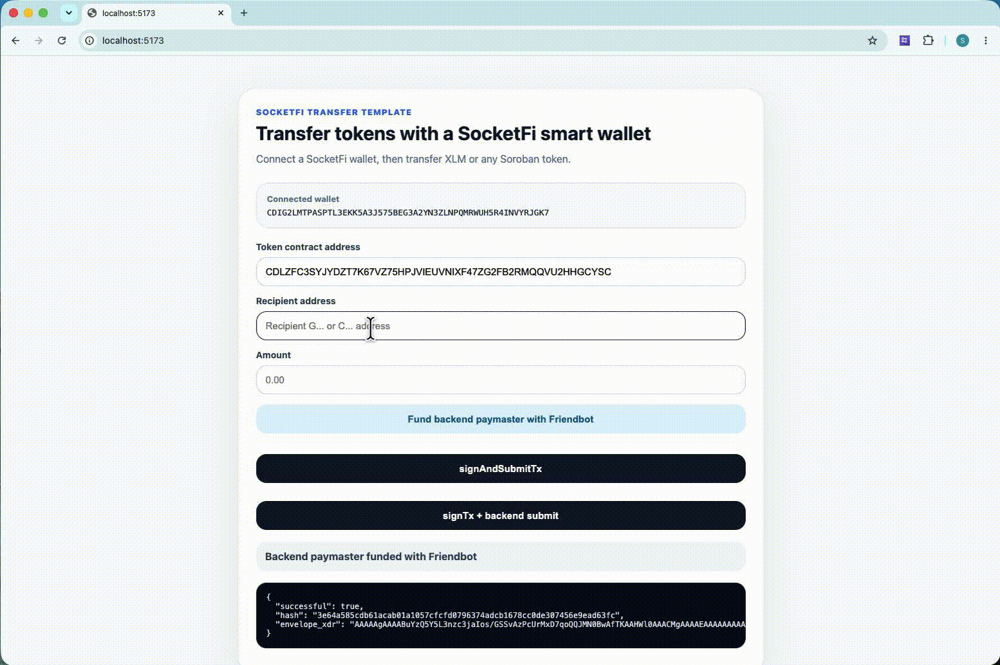
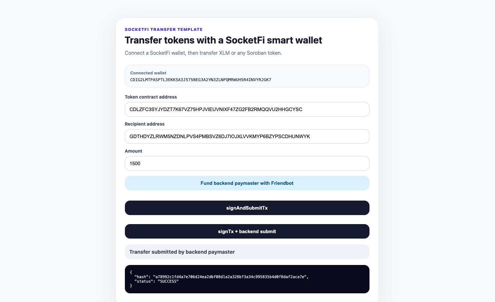

# SocketFi React Integration Reference


A production-ready reference application demonstrating how to integrate the **SocketFi Embedded Smart Account** into a React application.

This repository showcases the complete authentication and token transfer experience using the **SocketFi React SDK**, including hosted authentication, hosted transaction approval, and Soroban transaction execution.

Whether you're building a DeFi application, marketplace, game, NFT platform, or consumer application, this project provides a simple starting point for integrating embedded smart wallets into your React application.

---

## ✨ Features

- 🔐 Passkey-based authentication
- 👛 Embedded Soroban smart wallet
- 💸 XLM transfers
- 🪙 Custom Stellar token transfers
- ✅ Hosted transaction approval
- ⚡ Automatic transaction submission
- 🏗 Backend transaction submission example
- 💰 Server-side fee sponsorship (Paymaster)
- ⚛️ React + TypeScript
- 🚀 Soroban Testnet ready

---

## Demo

The following demo showcases the complete authentication and token transfer experience using the SocketFi Embedded Wallet.



### Application Preview



---

# What You'll Learn

This reference application demonstrates how to:

- Authenticate users using SocketFi Passkeys
- Create embedded smart wallets
- Transfer native XLM
- Submit transactions using SocketFi
- Sign a transactions and submit using your own backend

---

# Transaction Workflows

This example supports two different transaction workflows depending on your application's architecture.

---

## 1. `signAndSubmitTx()`

**Recommended for most applications**

The frontend requests transaction approval and SocketFi handles everything else.

### Flow

```
User
   │
   ▼
React App
   │
   ▼
SocketFi SDK
   │
   ▼
Hosted Approval
   │
   ▼
User signs authorization
   │
   ▼
SocketFi submits transaction
   │
   ▼
Stellar Network
```

### Responsibilities

SocketFi handles:

- Wallet authorization
- Transaction approval UI
- Transaction submission
- Fee sponsorship

Your application only needs to request approval.

This is the simplest integration and is recommended for applications that do not require custom backend transaction processing.

---

## 2. `signTx() + Backend Submission`

**Recommended for production applications with backend infrastructure**

The frontend requests wallet authorization only.

Your backend assembles the transaction, signs it with your Paymaster, and submits it to the network.

### Flow

```
User
   │
   ▼
React App
   │
   ▼
SocketFi SDK
   │
   ▼
Hosted Approval
   │
   ▼
Signed Authorization
   │
   ▼
Backend
   │
   ▼
Paymaster Signature
   │
   ▼
Submit Transaction
   │
   ▼
Stellar Network
```

### Responsibilities

Frontend

- Authenticate user
- Request approval
- Receive signed authorization

Backend

- Assemble transaction
- Sign using Paymaster
- Submit transaction

This approach keeps your Paymaster secret securely on your backend.

---

# Architecture

```
                    React Application
                           │
                           ▼
                  SocketFi React SDK
                           │
          ┌────────────────┴────────────────┐
          │                                 │
          ▼                                 ▼
 Hosted Authentication          Hosted Transaction Approval
          │                                 │
          └────────────────┬────────────────┘
                           ▼
                 Embedded Smart Wallet
                           │
                           ▼
                  Stellar Soroban Network
```

---

# Getting Started

## Clone the repository

```bash
git clone git@github.com:Socket-Fi/socketfi-react-integration-reference.git

cd socketfi-react-integration-reference
```

---

## Install dependencies

```bash
npm install

npm run install:all
```

---

## Configure Environment Variables

A preconfigured `.env` file is included for convenience and is ready to use with the demo.

If you need to customize the configuration (for example, to use your own SocketFi application or backend), update the following values:

```env
VITE_CLIENT_ID=YOUR_SOCKETFI_CLIENT_ID

VITE_NETWORK=TESTNET

VITE_SERVER_URL=http://localhost:4000
```

To create your own **Client ID**, create a new application in the **SocketFi Developer Console**:

https://console.socket.fi

---

## Start the whole application (frontend and server)

```bash
npm run dev
```

---

# Project Structure

```
.
├── client
│   ├── src
│   │   ├── components
│   │   ├── hooks
│   │   ├── utils
│   │   └── App.tsx
│   └── package.json
│
├── server
│   ├── routes
│   ├── services
│   ├── index.ts
│   └── package.json
│
├── .env.example
└── README.md
```

---

# Environment Variables

| Variable          | Description           |
| ----------------- | --------------------- |
| `clientId`        | SocketFi Client ID    |
| `VITE_NETWORK`    | `TESTNET` or `PUBLIC` |
| `VITE_SERVER_URL` | Backend server URL    |

---

# SDK Overview

The application uses the official SocketFi React SDK.

Authentication:

```ts
const session = await socketfi.authenticate();
```

Sign transaction only:

```ts
await socketfi.signTx(...)
```

Sign and submit:

```ts
await socketfi.signAndSubmitTx(...)
```

---

# Authentication

Authentication uses SocketFi's hosted authentication experience.

Features include:

- Passkey authentication
- Embedded wallet creation
- Secure session management
- No browser extensions required
- No seed phrases

After authentication, the SDK returns:

```ts
{
  address, socketfiAccessToken;
}
```

The access token is required for all protected wallet operations.

---

# Token Transfers

This demo supports transferring:

- Native XLM
- Stellar Asset Contract Tokens

The application automatically builds the appropriate Soroban contract invocation before requesting user approval.

---

# Fee Sponsorship

When using `signAndSubmitTx()`, transaction fees are sponsored automatically using the Paymaster configured for your SocketFi project.

When using `signTx()`, your backend is responsible for:

- Building the transaction
- Signing with the Paymaster
- Submitting the transaction

This keeps your Paymaster secret securely on your server.

---

# Why Two Transaction Flows?

SocketFi supports two workflows to accommodate different application architectures.

| Workflow            | Backend Required | Recommended For                                   |
| ------------------- | ---------------- | ------------------------------------------------- |
| `signAndSubmitTx()` | No               | Most applications                                 |
| `signTx()`          | Yes              | Production applications requiring backend control |

---

# Customizing This Demo

You can easily extend this project to:

- Call custom Soroban contracts
- Read contract state
- Add swaps
- Build NFT applications
- Integrate DeFi protocols
- Add wallet guardians
- Customize branding
- Connect to Mainnet

---

# Supported Stack

- React 18+
- React 19+
- TypeScript
- Vite
- SocketFi React SDK v2
- Soroban
- Stellar Testnet

---

# Resources

- **Developer Console**  
  Create and manage your SocketFi applications, obtain Client IDs, configure branding, and manage your project settings.  
  https://console.socket.fi

- **Documentation**  
  Integration guides, SDK documentation, API references, and tutorials.  
  https://docs.socket.fi

- **React SDK**  
  https://www.npmjs.com/package/@socketfi/react

- **Website**  
  https://socket.fi

---

# Who Is This For?

This reference project is ideal for developers building:

- DeFi applications
- NFT platforms
- Wallets
- Marketplaces
- Consumer applications
- AI agents
- Fintech applications
- Games
- Soroban smart contract integrations

---

# Next Steps

After exploring this example, consider:

- Integrating your own backend Paymaster
- Calling custom Soroban contracts
- Reading contract state
- Adding wallet guardians
- Customizing the hosted authentication experience
- Deploying to Stellar Mainnet

---

# Contributing

Contributions, issues, and feature requests are welcome.

If you discover an issue or have suggestions for improving this reference implementation, feel free to open an issue or submit a pull request.

---

# License

MIT

---

# Learn More

- 🌐 Website: https://socket.fi
- 📚 Documentation: https://docs.socket.fi
- 📦 SDK: https://www.npmjs.com/package/@socketfi/react

---

Built with ❤️ using **SocketFi**, **React**, and **Stellar Soroban**.
